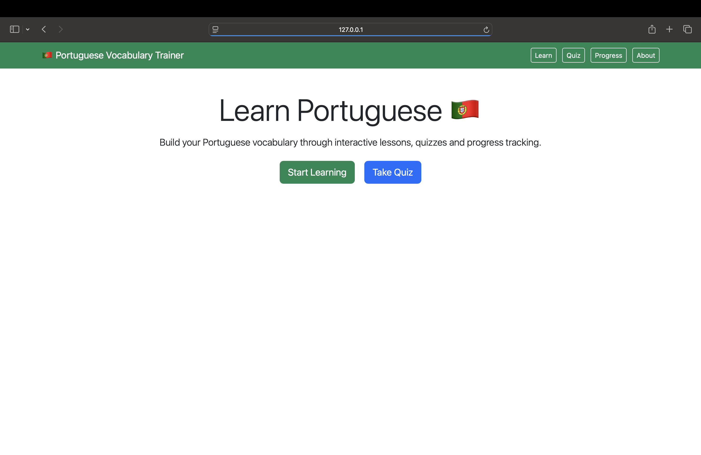
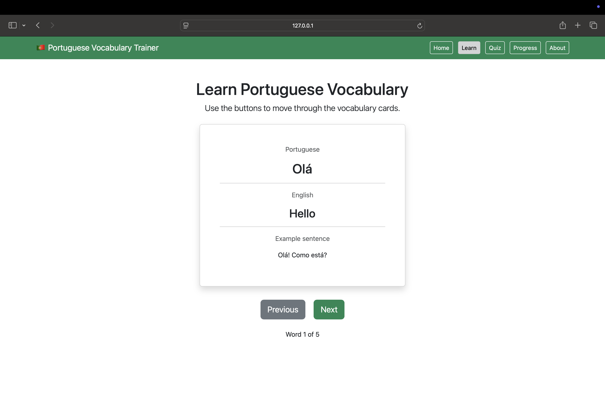
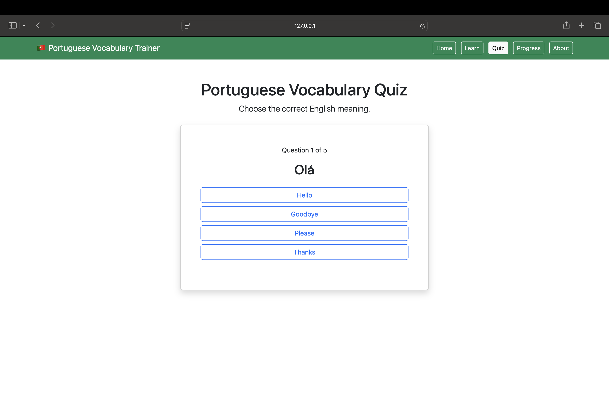
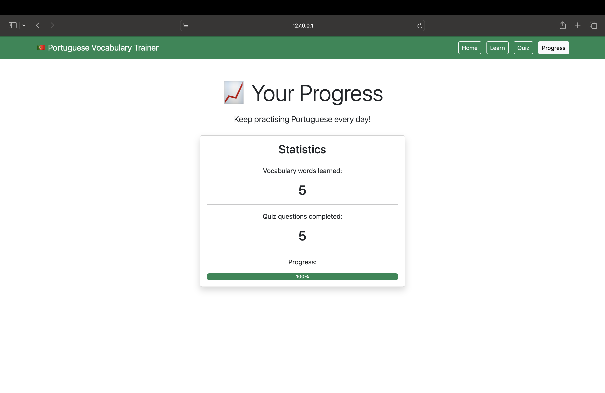
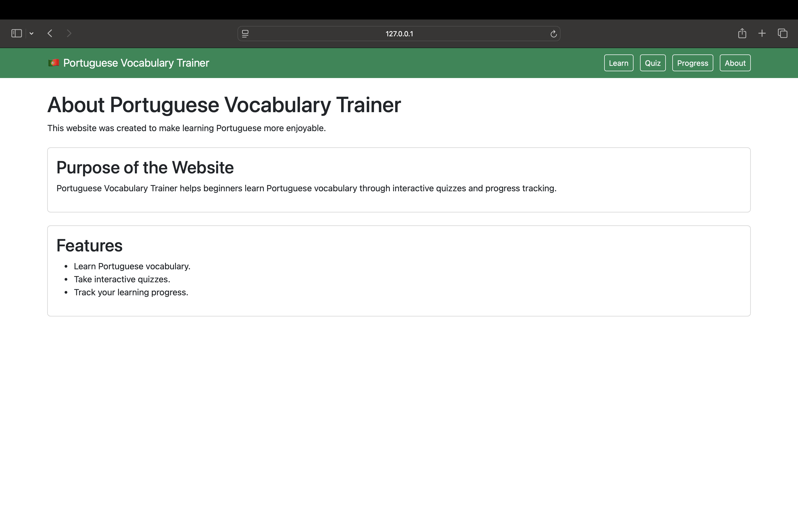

# Portuguese Vocabulary Trainer

## Introduction

The Portuguese Vocabulary Trainer is a simple educational web application designed to help beginners learn basic Portuguese vocabulary.

The website allows users to study common Portuguese words, test their knowledge through an interactive quiz, and monitor their learning progress.

The project was created using HTML5, Bootstrap 5, and JavaScript, providing a clean, responsive, and user-friendly interface.

The aim of the application is to make learning Portuguese enjoyable while demonstrating front-end web development skills.

## Live Website

The live version of the project can be viewed here:

[Portuguese Vocabulary Trainer](https://krisztina-sketch.github.io/portuguese-vocabulary-trainer/)
## GitHub Repository

The source code for this project is available on GitHub:

[GitHub Repository](https://github.com/Krisztina-sketch/portuguese-vocabulary-trainer)

## Design

The website was designed with simplicity and ease of use in mind. A clean layout, consistent colour scheme, and clear navigation make it easy for users to move between pages. Bootstrap 5 was used to create a responsive design so the application works well on different screen sizes. The green navigation bar reflects the colours of the Portuguese flag, while the white background improves readability. Large headings, buttons, and cards help users quickly understand how to use the application.

## User Stories

- As a user, I want to learn common Portuguese vocabulary so that I can improve my language skills.

- As a user, I want to test my knowledge with a quiz so that I can see what I have learned.

- As a user, I want to view my learning progress so that I can keep track of my results.

- As a user, I want the website to be easy to navigate so that I can quickly access each feature.

## Features

## Screenshots

### Home Page

### Learn Page

### Quiz Page

### Progress Page

### About Page

### Home Page

- Introduces the Portuguese Vocabulary Trainer.
- Contains navigation links to all pages.
- Provides quick access to the Learn and Quiz sections through large buttons.

### Learn Page

- Displays Portuguese vocabulary cards.
- Shows the Portuguese word together with its English translation.
- Allows users to move through vocabulary using the Next button.

### Quiz Page

- Presents five multiple-choice questions.
- Gives immediate feedback after each answer.
- Displays the final score at the end of the quiz.
- Allows the user to restart the quiz.

### Progress Page

- Displays the user's most recent quiz score.
- Shows the highest score achieved.
- Uses Local Storage to save progress even after refreshing the page.

### About Page

- Explains the purpose of the website.
- Describes how the application helps users learn Portuguese vocabulary.

## Technologies Used

- **HTML5**
  - Used to create the structure of each webpage.

- **CSS3**
  - Used to style the website and improve its appearance.

- **Bootstrap 5**
  - Used to create a responsive layout, navigation bar, buttons, and cards quickly.

- **JavaScript**
  - Used to add interactivity such as vocabulary navigation, quiz functionality, score calculation, and Local Storage.

  ## Testing

  The website was tested throughout development to ensure that all pages, navigation links, buttons, and JavaScript functionality worked correctly. Testing was carried out on different screen sizes to confirm that the website is responsive.

  | Feature | Expected Result | Actual Result | Status |
|---------|-----------------|---------------|--------|
| Navigation Bar | All links open the correct page | All links worked correctly | ✅ Pass |
| Home Page | Home page loads correctly | Loaded as expected | ✅ Pass |
| Learn Page | Next button displays the next vocabulary word | Worked correctly | ✅ Pass |
| Quiz Page | Quiz checks answers and calculates the score | Worked correctly | ✅ Pass |
| Progress Page | Displays the last and best quiz scores | Worked correctly | ✅ Pass |
| About Page | Displays information about the project | Worked correctly | ✅ Pass |

## Bugs

### Fixed Bugs

- The quiz score was not updating correctly. This was fixed by improving the JavaScript score calculation.
- Navigation links were checked to ensure they directed users to the correct pages.
- Local Storage was tested to ensure the last and best quiz scores were saved correctly.

### Known Bugs

- No known bugs at the time of submission.

## Deployment

## Deployment

This project was deployed using GitHub Pages.

### Deployment Steps

1. Log in to GitHub.
2. Open the Portuguese Vocabulary Trainer repository.
3. Click the **Settings** tab.
4. Select **Pages** from the left-hand menu.
5. Under **Build and Deployment**, select **Deploy from a branch**.
6. Choose the **main** branch.
7. Select the **/(root)** folder.
8. Click **Save**.
9. After a few minutes, GitHub Pages publishes the website and provides the live URL.

### Steps to Deploy

1. Log in to GitHub.
2. Open the project repository.
3. Select the **Settings** tab.
4. Click **Pages** from the left-hand menu.
5. Under **Source**, choose **Deploy from a branch**.
6. Select the **main** branch.
7. Click **Save**.
8. After a few moments, the live website becomes available through the GitHub Pages link.

## Credits

### Content

- Portuguese vocabulary and all written content were created by the developer for educational purposes.

### Media

- All screenshots were created by the developer.
- No external images were used in this project.

### Code

- Bootstrap 5 documentation was used for the navigation bar, cards, buttons, and responsive layout.
- MDN Web Docs were used as a reference while developing the JavaScript functionality.

## AI Acknowledgement

Artificial Intelligence (ChatGPT by OpenAI) was used as a learning support tool during the development of this project. AI assistance was used to explain programming concepts, improve code understanding, assist with debugging, and provide guidance while writing the project documentation. All code was reviewed, tested, and understood before being included in the final project.

## Future Improvements

Possible future improvements include:

- Add more Portuguese vocabulary categories.
- Include pronunciation audio for each word.
- Add different quiz difficulty levels.
- Improve the progress page with statistics and charts.
- Allow users to reset their saved progress.
