# Portuguese Vocabulary Trainer

## Introduction

Portuguese Vocabulary Trainer is a responsive educational web application for beginners who want to practise a small set of common Portuguese words. Users can review vocabulary cards, complete a multiple-choice quiz and view a simple progress page.

The project was built with HTML5, CSS3, Bootstrap 5 and JavaScript.

## Live Website

[Portuguese Vocabulary Trainer](https://krisztina-sketch.github.io/portuguese-vocabulary-trainer/)

## GitHub Repository

[GitHub Repository](https://github.com/Krisztina-sketch/portuguese-vocabulary-trainer)

## UX and Design

### Target User

The primary user is a beginner Portuguese learner who wants a simple, low-pressure way to review basic vocabulary and check understanding through a short quiz.

### User Goals

- Learn a small set of common Portuguese words and their English meanings.
- Move backwards and forwards through vocabulary cards without leaving the page.
- Test learning through a short multiple-choice quiz.
- Receive immediate feedback after choosing an answer.
- See a final score and be able to restart the quiz.
- Navigate easily between the learning, quiz, progress and information pages.

### Design Decisions

The interface deliberately uses a simple card-based layout so the learner can focus on one task at a time. Bootstrap provides responsive spacing, buttons and navigation. Green is used prominently because it relates visually to the Portuguese flag and also gives the application a consistent identity. White space and large headings improve readability.

The Learn page keeps one vocabulary item in focus at a time. The Quiz page displays one question at a time to avoid overwhelming the learner. Immediate feedback helps the learner understand mistakes before moving on.

## Wireframes

Wireframes were produced before development to plan the page structure, navigation and placement of the main interactive elements.

### Homepage Wireframe

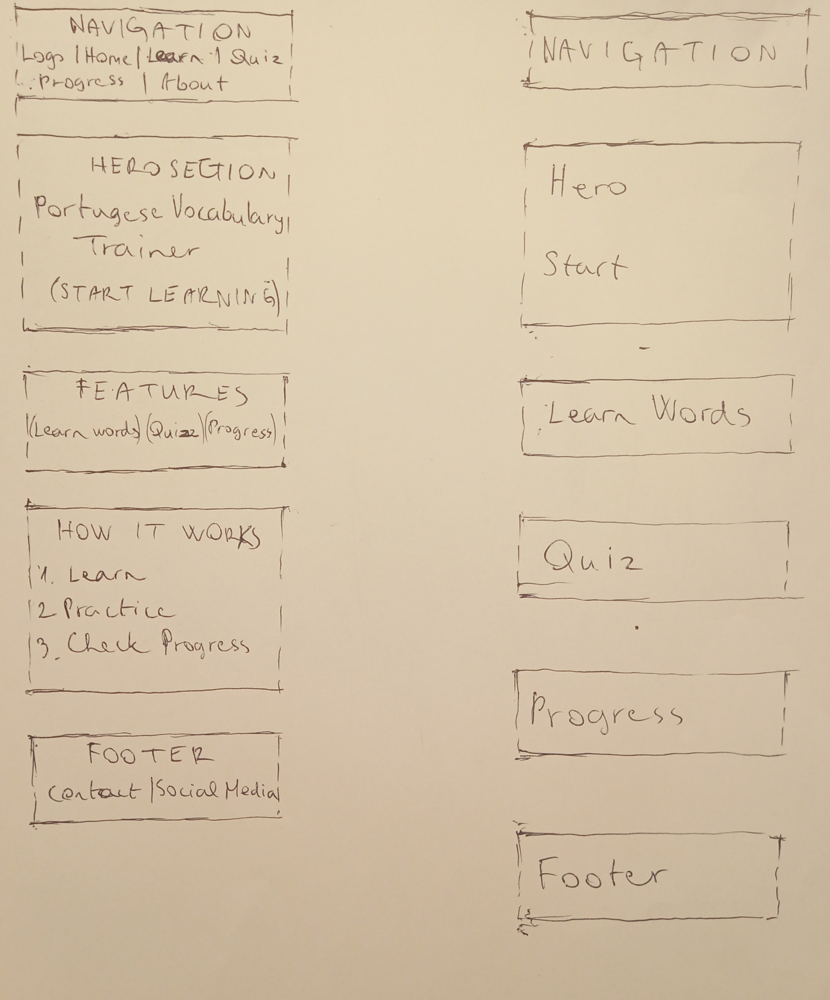

## User Stories

| User Story | Acceptance Criteria |
|---|---|
| As a beginner, I want to learn common Portuguese vocabulary so that I can improve my language skills. | The Learn page displays Portuguese words, English meanings and example sentences. |
| As a learner, I want to move through vocabulary cards so that I can revise at my own pace. | Previous and Next buttons change the displayed vocabulary item. |
| As a learner, I want to test my knowledge so that I can see what I remember. | The Quiz page presents multiple-choice questions and checks answers. |
| As a learner, I want immediate feedback so that I know when I am correct or incorrect. | Each answer displays clear correct/incorrect feedback. |
| As a learner, I want to see my score so that I can judge my performance. | The quiz displays a final score after the last question. |
| As a user, I want clear navigation so that I can move between features quickly. | Navigation links connect the Home, Learn, Quiz, Progress and About pages. |

## Features

### Home Page

- Introduces the application and its purpose.
- Provides navigation to the main learning features.
- Includes prominent buttons to start learning or take the quiz.

### Learn Page

- Displays Portuguese vocabulary with English translations and example sentences.
- Previous and Next controls allow users to move through the vocabulary list.
- A counter shows the current word number.

### Quiz Page

- Presents five multiple-choice questions.
- Gives immediate feedback after each answer.
- Prevents repeated scoring by disabling answer buttons after a choice.
- Displays the final score.
- Stores the last and best quiz scores in localStorage.
- Allows the user to restart the quiz.

### Progress Page

- Presents a simple visual summary of the learning set and completion percentage.

### About Page

- Explains the purpose of the application and its main features.

### Responsive Design

- Bootstrap is used for responsive layout, spacing, navigation, cards and buttons.
- Custom presentation rules are stored in `assets/css/style.css` instead of inline HTML styles.

## Screenshots

### Home Page
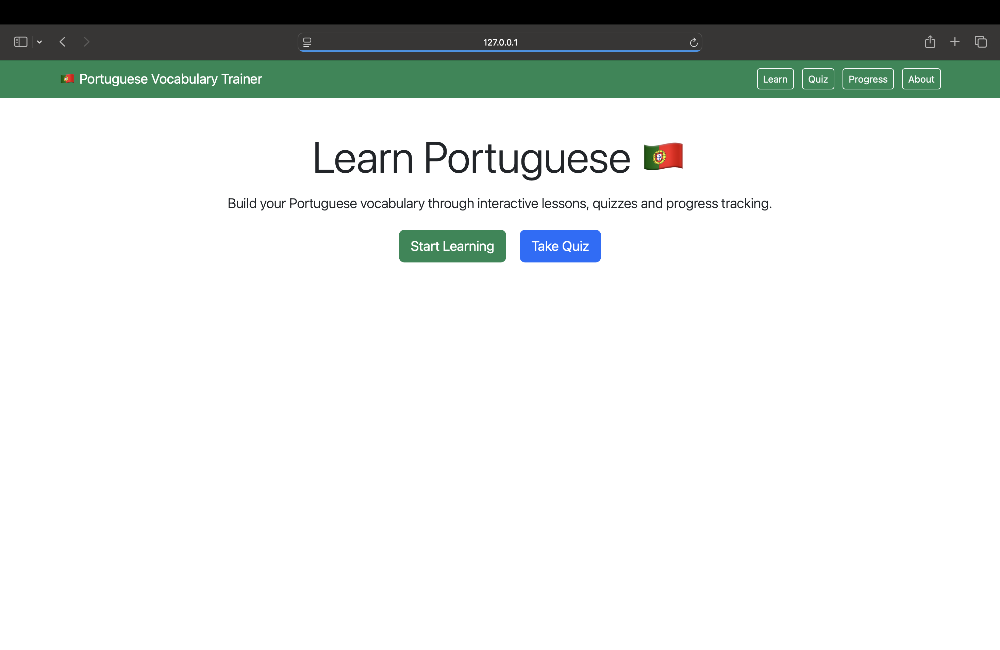

### Learn Page
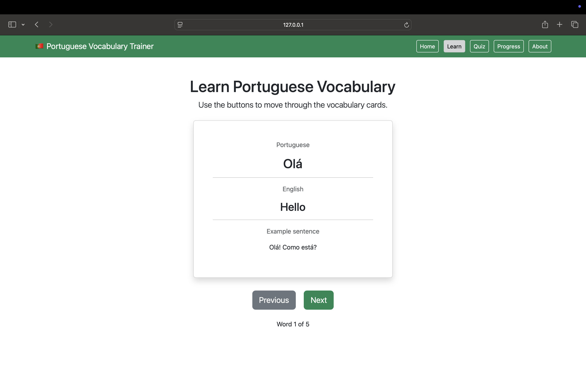

### Quiz Page
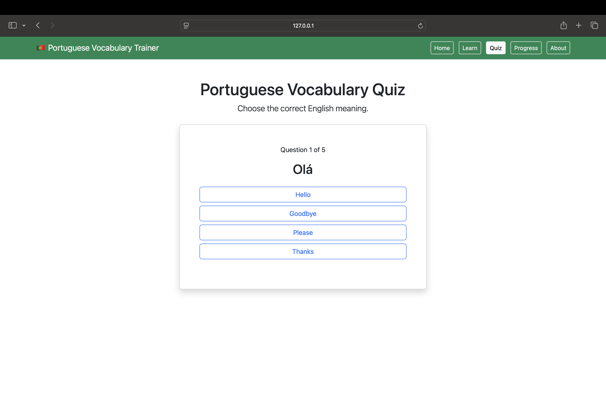

### Progress Page
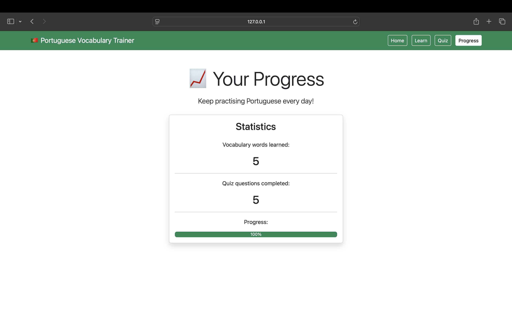

### About Page
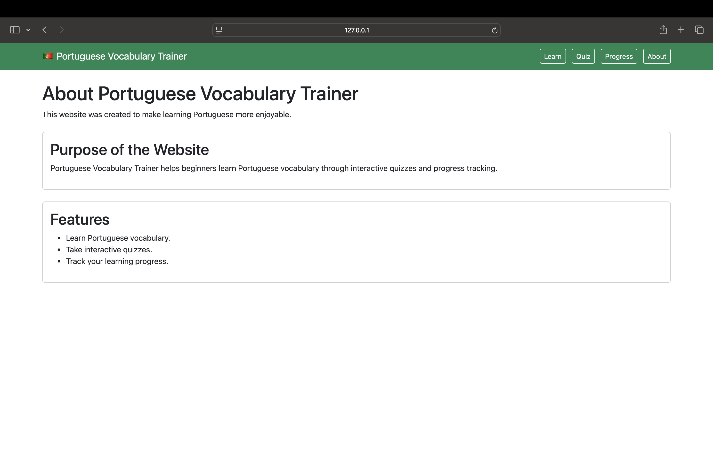

## Technologies Used

- HTML5 — semantic page structure.
- CSS3 — custom presentation rules.
- Bootstrap 5 — responsive layout and UI components.
- JavaScript — vocabulary navigation, quiz behaviour, scoring and localStorage.
- Git and GitHub — version control and source hosting.
- GitHub Pages — deployment.

## AI Assistance

Generative AI, primarily ChatGPT, was used extensively throughout the development of this project.

AI assistance was used to help:

- generate and structure the HTML, CSS and JavaScript;
- explain JavaScript concepts and application logic;
- troubleshoot errors and unexpected behaviour;
- improve code organisation and readability;
- develop testing documentation;
- improve README documentation.

ChatGPT was used as a development aid throughout the project, including for code suggestions, troubleshooting, explanations and documentation. The resulting code was reviewed, adapted, tested and integrated into the project to meet the required functionality.

The generated code was integrated into the project, tested against the required functionality, revised where issues were identified, and validated using appropriate testing tools.

AI assistance is also acknowledged within the relevant source files through code comments.

## Testing

Testing was carried out against the project features and user stories. The revised project separates custom CSS from the HTML and includes comments explaining the JavaScript logic.

### Manual and Automated Testing

Manual testing was used to check the behaviour of the application from a user's perspective, including navigation, vocabulary controls, quiz answers, scoring, responsiveness and the deployed website.

Automated and validation tools were used where appropriate to identify code-quality and syntax issues. The W3C Nu HTML Checker was used for HTML validation, the W3C CSS Validation Service was used for CSS validation, and Node's syntax checker was used to verify the JavaScript files.

Manual testing is particularly useful for checking usability, visual layout, navigation and user interaction. Automated testing and validation tools are useful for consistently detecting syntax, structural and code-quality problems.

### Manual Functional Testing

| Test | Expected Result | Actual Result | Status |
| --- | --- | --- | --- |
| Open each navigation link | Correct page opens | All navigation links open the intended page | Pass |
| Click Next on Learn page | Next vocabulary item is displayed | Vocabulary changes and counter updates | Pass |
| Click Previous on Learn page | Previous vocabulary item is displayed | Vocabulary changes and counter updates | Pass |
| Continue past final vocabulary item | Revision continues from the start | Vocabulary loops back to the first item | Pass |
| Select correct quiz answer | Correct feedback appears and score increases | Correct feedback appears and score increases | Pass |
| Select incorrect quiz answer | Incorrect feedback appears and score does not increase | Correct answer is displayed and score remains unchanged | Pass |
| Click Next Question | Next quiz question appears | Question number and content update | Pass |
| Complete final question | Final score appears | Quiz completion message and score appear | Pass |
| Click Try Again | Quiz restarts | Quiz restarts from question one with score reset | Pass |
| Refresh after quiz | Stored score remains available | Last and best scores remain in localStorage | Pass |

### User Story Testing

| User Story | Test Result |
| --- | --- |
| Learn common Portuguese vocabulary | Learn page displays five vocabulary items with translations and examples. Pass. |
| Move through vocabulary cards | Previous and Next controls work in both directions. Pass. |
| Test knowledge with a quiz | Five multiple-choice questions can be completed. Pass. |
| Receive immediate feedback | Correct/incorrect feedback appears after each selection. Pass. |
| See a final score | Final score appears after the final question. Pass. |
| Navigate easily | Navigation links work across all pages. Pass. |

### Responsive Testing

The application was manually checked at different viewport sizes to confirm that content remains readable and usable.

| Device / Viewport | Test | Result |
| --- | --- | --- |
| Mobile | Navigation, text, cards and buttons remain usable without horizontal overflow | Pass |
| Tablet | Page content and controls resize correctly | Pass |
| Desktop | Content displays correctly with appropriate spacing | Pass |

Bootstrap's responsive layout and navigation components help the site adapt across screen sizes.

### Development and Deployed Version Testing

The application was tested locally during development and then tested again using the live GitHub Pages deployment.

The deployed version was checked to confirm that:

- all navigation links work;
- vocabulary cards display and change correctly;
- quiz questions and answers function correctly;
- scoring and feedback work correctly;
- the Progress and About pages load correctly;
- CSS and JavaScript files load correctly.

The deployed application matched the tested development version.

### JavaScript Syntax Validation

The JavaScript files were checked using Node's syntax checker:

```bash
node --check assets/js/learn.js
node --check assets/js/quiz.js
### HTML and CSS Validation

All HTML pages were validated using the W3C Nu HTML Checker.

- `index.html` - Passed with no errors or warnings
- `about.html` - Passed with no errors or warnings
- `learn.html` - Passed with no errors or warnings
- `quiz.html` - Passed with no errors or warnings
- `progress.html` - Passed with no errors or warnings

During validation, an empty heading warning was identified on the Quiz page and corrected. A heading hierarchy issue was identified on the Progress page and corrected.

The CSS was validated using the W3C CSS Validation Service.

- `assets/css/style.css` - Passed with no errors

### Validation Evidence

#### HTML Validation

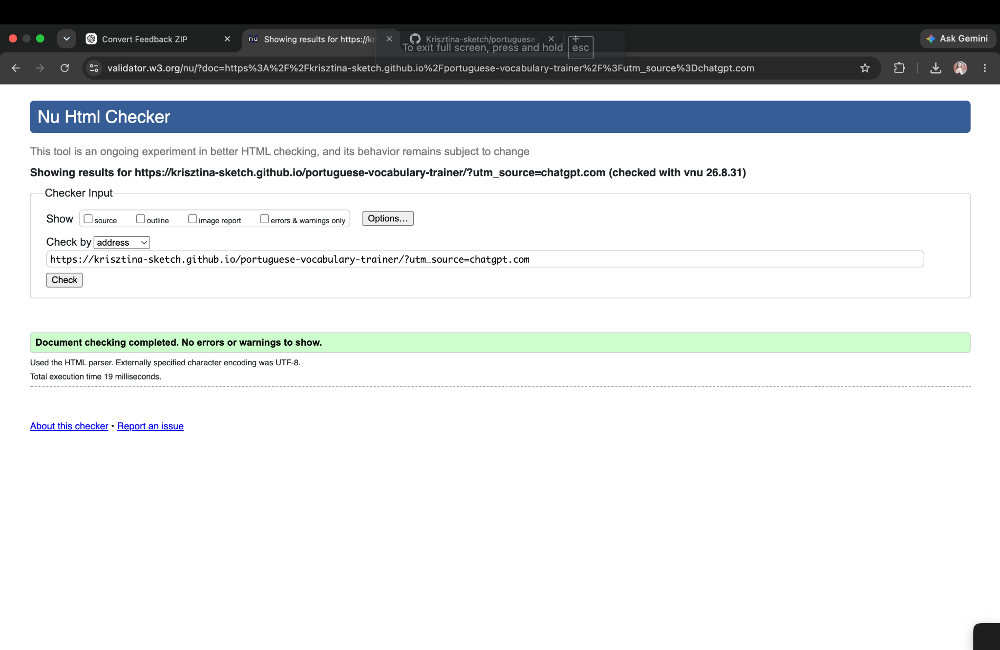

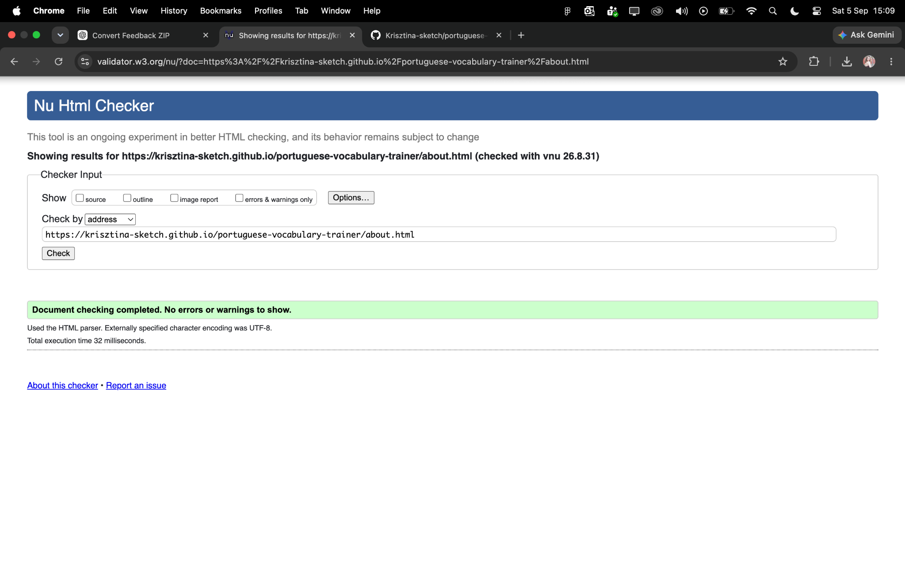

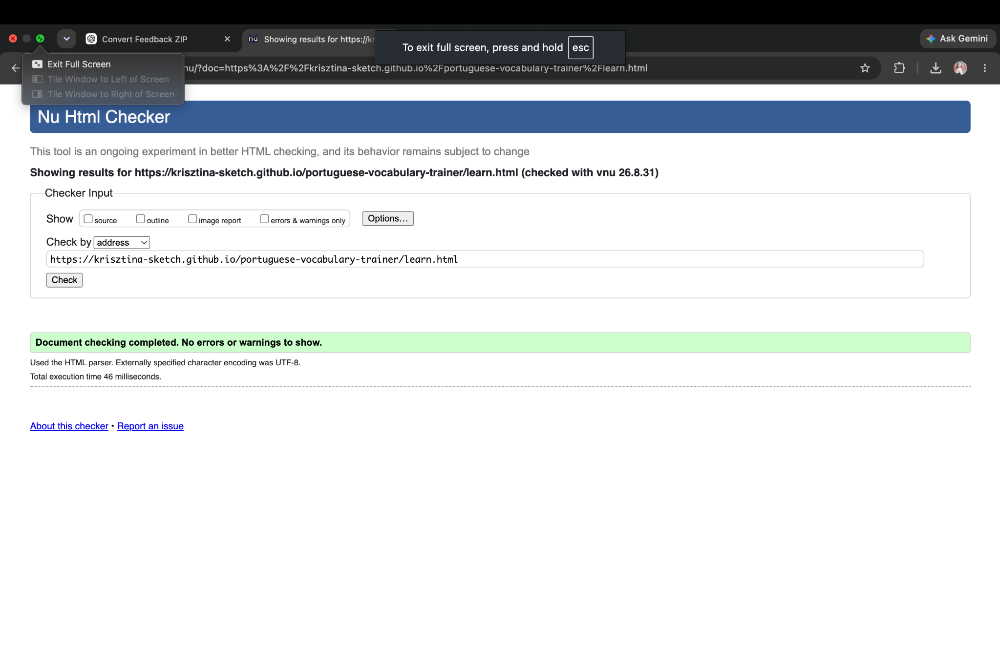

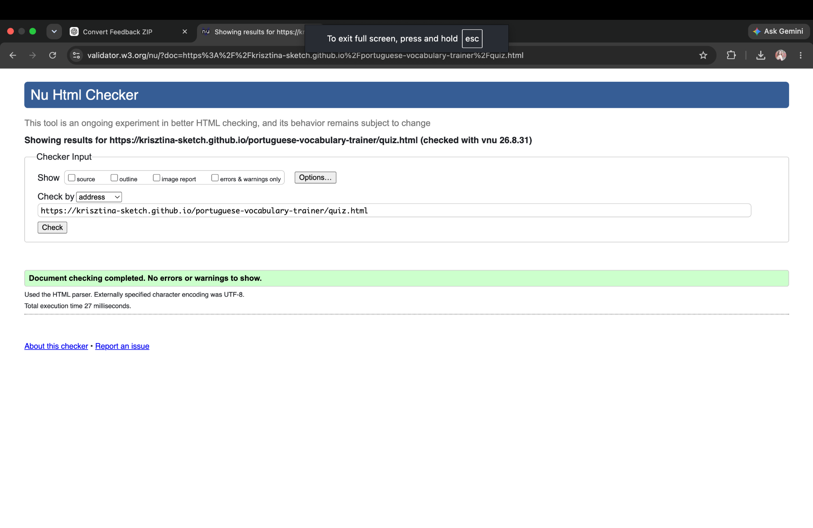

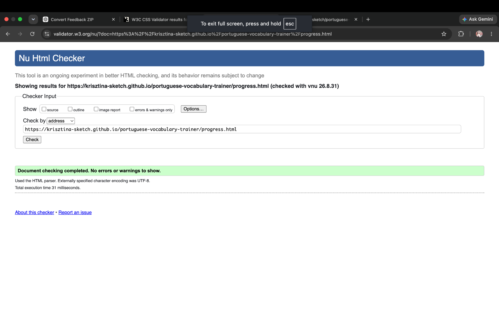

#### CSS Validation

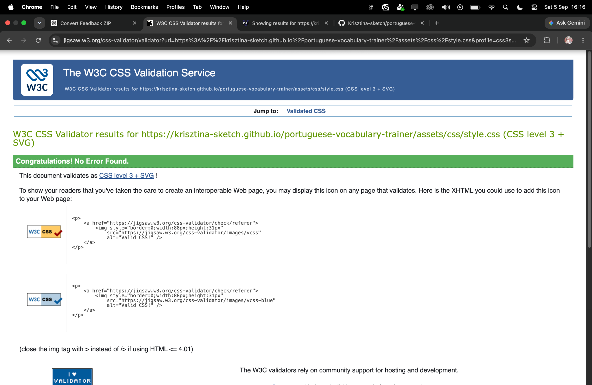

## Bugs

### Fixed Bugs

- Quiz score handling was checked to ensure the score only increases for correct answers.
- Answer buttons are disabled after a selection so one question cannot be scored repeatedly.
- Navigation links were checked to ensure they lead to the intended pages.
- Custom presentation styles were moved from inline `style` attributes into `assets/css/style.css`.
- JavaScript was commented to make the logic easier to understand and maintain.

### Known Limitations

- The Learn page intentionally loops back to the first card after the final vocabulary item. A future improvement would be to add a clear end-of-revision state or completion message.
- The Progress page currently presents a simple static summary rather than a detailed progress dashboard.

## Deployment

The project is deployed using GitHub Pages.

### Deployment Steps

1. Log in to GitHub.
2. Open the Portuguese Vocabulary Trainer repository.
3. Open **Settings**.
4. Select **Pages**.
5. Under **Build and deployment**, choose **Deploy from a branch**.
6. Select the `main` branch and `/(root)` folder.
7. Save the configuration.
8. Wait for GitHub Pages to publish the site.

## Credits

### Content and Media

- Portuguese vocabulary and written project content were prepared for this educational project.
- Project screenshots and wireframes are stored in the repository.
- Bootstrap 5 documentation and MDN Web Docs were used as technical references.

## AI Assistance

Generative AI (ChatGPT by OpenAI) was used extensively during development and revision of this project, including assistance with JavaScript, code structure, debugging and documentation. Because the JavaScript files were substantially AI-assisted, this is stated directly in comments at the top of `assets/js/learn.js` and `assets/js/quiz.js` rather than presenting any part of those files as independently written code.

The AI-assisted code was reviewed, tested and integrated into the project. The project owner should be able to explain the purpose of the main functions and event listeners before resubmission.

## Future Improvements

- Add more vocabulary categories and words.
- Add pronunciation audio.
- Add different quiz difficulty levels.
- Replace the static Progress page with statistics generated from localStorage.
- Add a clear completion state after the learner reaches the final vocabulary card.
